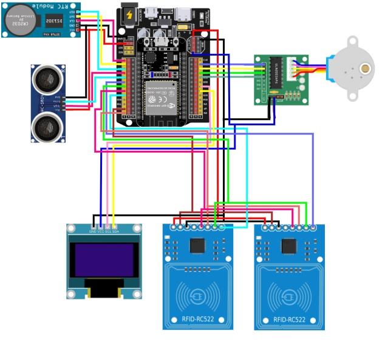

# PintuGerbangOtomatis (Releases 6)

# ESP32 Sistem Pintu Gerbang Otomatis



Sistem pintu gerbang otomatis menggunakan ESP32 dengan fitur lengkap termasuk OLED display, sensor ultrasonic, dual RFID, RTC module, WiFi, Blynk, dan web server.

## 🔧 Hardware Requirements

### Komponen Utama:
- **ESP32-30P** (Controller board)
- **LCD OLED I2C 128x64** (Display informasi)
- **2x MFRC522 RFID Reader** (Entry & Exit)
- **HC-SR04 Ultrasonic Sensor** (Deteksi kendaraan)
- **DS1302 RTC Module** (Real Time Clock)
- **Stepper Motor 28BYJ-48 + ULN2003** (Penggerak pintu)
- **Buzzer Aktif** (Audio feedback system)

### Pin Configuration:
```
RFID 1 (Entry)    : CS=21, RST=22
RFID 2 (Exit)     : CS=5,  RST=22
OLED Display      : SDA=32, SCL=33
Ultrasonic Sensor : TRIG=16, ECHO=17
RTC DS1302        : DAT=2, CLK=15, RST=4
Stepper Motor     : IN1=26, IN2=27, IN3=14, IN4=12
Buzzer            : Pin=13
```

## 📚 Library Dependencies

Sebelum mengcompile code, pastikan library berikut sudah terinstall di Arduino IDE:

### 1. ESP32 Board Package
```
Boards Manager → ESP32 by Espressif Systems
```

### 2. Core Libraries (Built-in)
- `WiFi.h`
- `WebServer.h`
- `SPIFFS.h`
- `Wire.h`
- `SPI.h`
- `Update.h`
- `Preferences.h`

### 3. External Libraries (Install via Library Manager)

#### RFID Library:
```
Library Manager → Search: "MFRC522"
Install: MFRC522 by GithubCommunity
```

#### OLED Display Library:
```
Library Manager → Search: "U8g2"
Install: U8g2 by oliver
```

#### RTC Library:
```
Library Manager → Search: "RtcDS1302"
Install: Rtc by Makuna
```

#### NTP Client Library:
```
Library Manager → Search: "NTPClient"
Install: NTPClient by Fabrice Weinberg
```

#### Blynk Library:
```
Library Manager → Search: "Blynk"
Install: Blynk by Volodymyr Shymanskyy
```

## 🚀 Installation Steps

### 1. Setup Arduino IDE
1. Download dan install Arduino IDE (versi 1.8.15 atau lebih baru)
2. Buka Arduino IDE
3. Go to **File → Preferences**
4. Tambahkan URL berikut di "Additional Board Manager URLs":
   ```
   https://raw.githubusercontent.com/espressif/arduino-esp32/gh-pages/package_esp32_index.json
   ```
   **Note:** Jika URL di atas tidak bekerja, gunakan alternatif:
   ```
   https://dl.espressif.com/dl/package_esp32_index.json
   ```

### 2. Install ESP32 Board
1. Go to **Tools → Board → Boards Manager**
2. Search "ESP32"
3. Install "ESP32 by Espressif Systems"

### 3. Install Required Libraries
Buka **Tools → Manage Libraries** dan install library berikut satu per satu:

```
1. MFRC522 by GithubCommunity
2. U8g2 by oliver  
3. Rtc by Makuna
4. NTPClient by Fabrice Weinberg
5. Blynk by Volodymyr Shymanskyy
```

### 4. Board Configuration
1. Select Board: **Tools → Board → ESP32 Arduino → ESP32 Dev Module**
2. Select Port: **Tools → Port → [Your ESP32 Port]**
3. Set Upload Speed: **921600**
4. Set Flash Frequency: **80MHz**
5. Set Flash Mode: **QIO**
6. Set Flash Size: **4MB (32Mb)**

## ⚙️ Configuration

### 1. Blynk Setup
1. Buat akun di [Blynk.cloud](https://blynk.cloud)
2. Buat template baru dengan nama "pintu gerbang"
3. Dapatkan Template ID dan Auth Token
4. Update konfigurasi di code atau via web interface

### 2. WiFi Setup
- **AP Mode Default:**
  - SSID: `PintuGerbang`
  - Password: `tidakada`
- **Client Mode:** Dapat dikonfigurasi via web interface

### 3. Web Interface
Setelah ESP32 terhubung ke WiFi, akses web interface di:
- **Client Mode:** `http://[ESP32_IP_ADDRESS]`
- **AP Mode:** `http://192.168.4.1`

## 🎯 Features

### ✅ Hardware Integration
- [x] LCD OLED I2C untuk display status
- [x] Sensor Ultrasonic untuk deteksi kendaraan
- [x] 2 RFID Reader untuk entry/exit
- [x] RTC Module untuk waktu real-time
- [x] Stepper Motor untuk kontrol pintu
- [x] **Buzzer System untuk audio feedback**

### ✅ Software Features
- [x] WiFi Client/AP Mode
- [x] Web Server dengan interface lengkap
- [x] Blynk Integration
- [x] RFID UID Management
- [x] Auto-close setelah 5 detik
- [x] NTP Time Synchronization
- [x] Firmware Update via Web
- [x] History Logging
- [x] **Buzzer Configuration System**
- [x] **Audio Feedback untuk RFID Events**

### ✅ Buzzer Audio Feedback
- [x] **Double Beep:** RFID valid terdeteksi
- [x] **Triple Beep:** RFID invalid/tidak terdaftar
- [x] **Single Beep:** Aksi ditolak (pintu sudah terbuka/bergerak)
- [x] **Long Beep:** Indikasi pintu sedang bergerak
- [x] **Configurable:** Enable/disable dan durasi beep dapat diatur

### ✅ Web Interface Tabs
- [x] Status Pintu Gerbang
- [x] Waktu & Tanggal
- [x] Konfigurasi Blynk
- [x] Sensor Ultrasonic (Pengaturan jarak deteksi)
- [x] Manajemen UID
- [x] Pengaturan WiFi/AP
- [x] Update Firmware

## 🔄 Usage Flow

1. **Power On:** Sistem akan boot dan menampilkan status di OLED
2. **WiFi Connection:** Otomatis connect ke WiFi tersimpan atau buat AP
3. **RFID Access:** 
   - Scan kartu RFID untuk buka pintu
   - **Double beep** jika kartu valid dan pintu terbuka
   - **Triple beep** jika kartu tidak valid/tidak terdaftar
   - **Single beep** jika aksi ditolak (pintu sudah terbuka/bergerak)
4. **Vehicle Detection:** Sensor ultrasonic deteksi kendaraan
5. **Auto Close:** Pintu otomatis tutup setelah kendaraan lewat + 5 detik delay
6. **Web Control:** Akses web interface untuk konfigurasi dan monitoring
7. **Blynk Control:** Kontrol via aplikasi Blynk mobile

## 🛠️ Troubleshooting

### Compilation Errors:
- Pastikan semua library sudah terinstall
- Periksa versi Arduino IDE (minimal 1.8.15)
- Pastikan ESP32 board package sudah terinstall

### Upload Errors:
- Periksa koneksi USB
- Pastikan port yang benar sudah dipilih
- Tekan tombol BOOT saat upload jika diperlukan

### Runtime Issues:
- Periksa koneksi hardware sesuai pin configuration
- Monitor Serial output untuk debugging
- Pastikan power supply cukup untuk semua komponen

### Buzzer Issues:
- **Buzzer tidak bunyi:** Periksa koneksi pin 13, pastikan buzzer aktif (bukan pasif)
- **Buzzer terlalu keras/pelan:** Sesuaikan durasi beep via web interface
- **Buzzer bunyi terus:** Restart ESP32, periksa konfigurasi buzzer
- **Wiring Buzzer:**
  ```
  Buzzer VCC → ESP32 3.3V atau 5V
  Buzzer GND → ESP32 GND  
  Buzzer Signal → ESP32 Pin 13
  ```

### Hardware Wiring Check:
```
ESP32 Pin 13 → Buzzer Signal (Active Buzzer)
ESP32 3.3V   → Buzzer VCC
ESP32 GND    → Buzzer GND
```

## 📞 Support

Jika mengalami masalah:
1. Periksa Serial Monitor untuk error messages
2. Pastikan semua koneksi hardware sudah benar
3. Verifikasi konfigurasi library dan board settings
4. Check dokumentasi masing-masing library jika ada issue spesifik

## 📄 License

Project ini dibuat untuk keperluan edukasi dan pengembangan sistem otomasi pintu gerbang.
